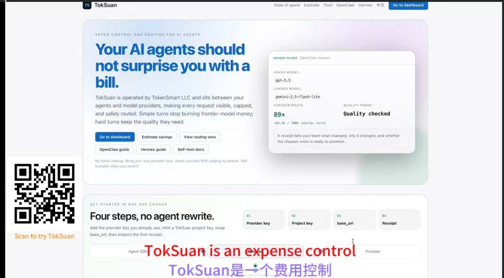

# TokSuan

> **面向 AI agent 的花费控制与模型路由网关。**
> 让每一轮 agent 调用都可见、可限额，并且只在回执证明安全时
> 自动路由到更便宜的模型。

[](LICENSE)
[](https://bun.sh)
[](#为什么是-toksuan)

[English](README.md) | 中文



TokSuan 由 TokenSmart LLC 运营，位于你的 agent 和上游模型提供商之间。
它保持工具已经兼容的 OpenAI API 形状，同时增加花费回执、预算、循环
保护和基于证据的模型路由。

它不是一个“便宜模型代理”：简单任务可以路由到快速低价模型；困难 /
前沿任务会继续留在高质量模型上，除非你的真实流量证明切换是安全的。
每个项目的真实请求会逐步改善后续路由。

```bash
curl https://gateway.tokensmt.com/v1/chat/completions \
  -H "Authorization: Bearer ts_your_project_key" \
  -H "Content-Type: application/json" \
  -d '{"model":"gpt-4o-mini","messages":[{"role":"user","content":"用 5 个字打个招呼"}]}'
```

可以在 [tokensmt.com](https://tokensmt.com) 体验托管版本，也可以从本仓库
自托管。

## 为什么是 TokSuan

长时间运行的 AI agents 会带来三个运营问题：

| 问题 | TokSuan 的回答 |
|---|---|
| 你看不清每一轮 agent 调用花了多少钱 | 请求账本记录模型、token、延迟、标签、成本和节省 |
| 循环调用可能在你发现前烧掉预算 | 日 / 月预算、循环检测、套餐上限，均在上游扣费前执行 |
| 前沿模型经常处理很简单的任务 | 基于基准和真实流量的路由、shadow 试验、可审计回执 |
| Agents 需要多个模型家族 | BYO OpenAI、Anthropic、Google、DeepSeek、Qwen、Doubao 等 provider keys，并按任务路由 |

每个请求都会得到一份回执：

```text
X-Tokensmart-Asked-Model: gpt-5.5
X-Tokensmart-Landed-Model: deepseek-chat
X-Tokensmart-Routing-Reason: baseline:chat:simple
X-Tokensmart-Cost-Saved-Vs-Asked-Cents: 0.940000
X-Tokensmart-Tool-Compress-Chars-Saved: 4200       # 仅在启用
X-Tokensmart-Tool-Compress-Saved-Cents: 0.060000   # 工具结果压缩时出现
```

对于付费 API provider，TokSuan 可以按 token 价格展示美元节省。对于自托管
或自定义 endpoint，它会展示路由和容量迁移；如果配置了自定义价格，也能
展示对应成本。

TokSuan 不抽 token 差价，也不要求使用平台自有的分类器 key。默认情况下，
复杂度判断使用客户同 provider 家族的 BYO key（例如 OpenAI 请求用便宜的
OpenAI judge，Anthropic 请求用 Haiku，DeepSeek 请求用小 DeepSeek 模型）。
如果没有匹配的 BYO key，TokSuan 会回退到本地启发式判断，而不是把 prompt
发给另一个 provider。

## 工具结果压缩器（可选）

长时间运行的 coding agents 会反复把 `git status`、`cat`、`cargo test`
等命令输出塞回 LLM context。上游 provider 会把这些字节计为 input tokens。

TokSuan 内置一个可选的工具结果压缩器：扫描请求里的 `tool` / `function`
消息，识别常见内容形态，并在转发上游前做确定性压缩。这样 agent 代码不用改，
但每一轮 replay Bash 输出时都能少付一部分 input token。

当前识别的形态：

- **git status** — 压缩成 branch + 数量摘要，例如 `18 staged, 6 untracked`
- **git diff** — 去掉 `index` / `---` / `+++` 噪音，必要时按预算截断 diff body
- **shell listings** — `ls -l` / `find` / `tree`，保留头尾，中间省略
- **stack traces** — 保留 error message + 开头和结尾的关键 frames
- **NDJSON / structured logs** — 按 `level` 分桶并折叠重复行
- **ANSI 彩色输出** — 去掉 escape sequences
- **重复日志行** — 连续相同行折叠成 `<line> (xN)`

典型工具消息可节省 60-95%。运行下面命令可以看 7 个代表性输入的 before /
after：

```bash
cd apps/gateway
bun run preview:tool-compress
```

设计约束：

- **只处理 `tool` / `function` role 的消息。** system / user / assistant 内容
  永不修改。
- **只做启发式形态识别。** 到达 gateway 时原始命令名（如 `git status`）
  已经丢失，所以只能根据内容结构判断。未知形态保持原样。
- **确定性且幂等。** 同一内容压缩两次得到相同字节，循环检测 fingerprint
  保持稳定。
- **默认关闭。** 静默改写 prompt 会影响“我们记账但不乱动 payload”的信任
  契约。需要显式设置 `TOKENSMART_TOOL_COMPRESS_ENABLED=1`。单次请求可用
  `x-ts-tool-compress: off` 关闭。

启用后可见性：

- 响应头：`X-Tokensmart-Tool-Compress-Chars-Saved` 和
  `X-Tokensmart-Tool-Compress-Saved-Cents`
- Dashboard 的 “Saved · last 30 days” hero card 会出现
  **Tool-result compression** 维度
- 请求行 tags 会记录 `tool_compress_shape`、`tool_compress_chars_saved` 等
  审计信息

实现和 env knobs 见 `apps/gateway/src/tool-result-compressor.ts`。

## 为真实 agents 而建

OpenClaw 和 Hermes Agent 是本项目的参考工作负载：真实的个人 agents、
长会话、工具调用、上下文 replay、多 channel，以及失控烧钱风险。

把每个 agent 放到一个 TokSuan project，设置预算，并在 dashboard 里查看
每一轮调用。只要 agent 支持自定义 headers，就可以发送 `x-ts-agent`、
`x-ts-session`、`x-ts-turn` 和 `x-ts-channel`，TokSuan 会按会话聚合成本。

TokSuan 不是 action firewall。模型网关能控制模型花费，因为每个模型请求
都会经过它；但它不能保证拦住 shell 命令、数据库写入、云 API 或其他在
模型请求路径外执行的工具调用。TokSuan 的安全边界是行为可见性和成本护栏：
让 agent 活动和花费变得可理解，拦住失控模型循环，并在策略有证据时把任务
路由到更便宜的模型。

- OpenClaw quick guide: [`examples/openclaw/`](examples/openclaw/)
- Hermes Agent quick guide: [`examples/hermes-agent/`](examples/hermes-agent/)
- Advanced header contract: [`docs/integrations/openclaw.md`](docs/integrations/openclaw.md)
- Agent action boundary: [`docs/trust/agent-action-boundary.md`](docs/trust/agent-action-boundary.md)

## 包含什么

### Gateway

- OpenAI-compatible `/v1/chat/completions` proxy
- Native Anthropic `/v1/messages` adapter
- 支持 OpenAI、Anthropic、Google Gemini、DeepSeek、Qwen、Doubao
- Project API keys，静态存储时哈希
- 请求账本，sub-cent precision（`micro_cents`）以及安全的 tool-intent metadata
- 日 / 月预算和循环检测
- 带 public-safe model IDs 的 baseline routing policy
- Project routing rules、shadow mode、A/B quality proof
- 按 provider 的 BYO complexity judging 与 project-specific routing optimization
- Retry、failover、cache-control injection、tags、alerts、semantic cache
- **工具结果压缩器（可选）** — 在转发上游前压缩 `tool` / `function` 消息，
  覆盖 git status、git diff、stack traces、NDJSON logs、ANSI 输出和重复日志行

### Dashboard

- Email OTP auth
- Projects、API keys、budgets、routing rules、alerts、audit log
- Savings receipt 和 7-day value report
- 三维 savings hero card：**routing savings**、**prompt-cache savings**、
  **tool-result compression savings**
- Provider key 上传和加密存储
- 当调用方发送 attribution headers 时，提供 agents/session 视图
- Trust page 和生产健康姿态

### Deployment

- 本地 Docker Compose 开发
- **SQLite trial mode**：gateway 和 dashboard 使用同一个 SQLite 文件；无需
  Docker / Postgres，适合本地评估
- 生产 Compose 自托管文件
- Hosted-friendly env：Vercel dashboard + Render gateway + Neon Postgres
- 脚本化 retention 和 pricing freshness jobs（`bun run sweep-old-requests`、
  `bun run pricing-freshness`），可用任意 scheduler（cron / GitHub Actions /
  Fly / Kubernetes CronJob）

## 快速开始

### Hosted

1. 访问 [tokensmt.com](https://tokensmt.com)，选择 **Start free**。
2. 在 **Settings -> Provider keys** 添加一个上游 key。
3. 按产品内提示创建 project，并复制 `ts_...` API key。
4. 运行生成的 curl，或把 SDK / agent 指向 `https://gateway.tokensmt.com/v1`。
5. 在 dashboard 查看第一份回执。

### Self-host dev（Postgres）

```bash
git clone https://github.com/tokensmart-llc/toksuan.git
cd toksuan

docker compose up -d
cp apps/gateway/.env.example apps/gateway/.env
# 编辑 apps/gateway/.env，至少配置一个 provider key。

cd apps/gateway && bun install && bun run dev
cd ../dashboard && bun install && bun run dev
```

打开 [http://localhost:3000/dashboard](http://localhost:3000/dashboard)，然后向
gateway 发送一个 smoke request：

```bash
curl http://localhost:8787/v1/chat/completions \
  -H "Authorization: Bearer tokensmart-dev-key" \
  -H "Content-Type: application/json" \
  -d '{"model":"gpt-4o-mini","messages":[{"role":"user","content":"hi"}]}'
```

### Self-host trial（SQLite，无 Docker）

```bash
git clone https://github.com/tokensmart-llc/toksuan.git
cd toksuan

cat > apps/gateway/.env <<'EOF'
DATABASE_URL=sqlite:./data/toksuan-dev.db
OPENAI_API_KEY=sk-your-openai-key
EOF
cd apps/gateway && bun install && bun run dev &

cat > apps/dashboard/.env.local <<'EOF'
DATABASE_URL=sqlite:../gateway/data/toksuan-dev.db
TOKENSMART_AUTH_ENABLED=0
EOF
cd apps/dashboard && bun install && WATCHPACK_POLLING=true bun run dev
```

### 验证安装

```bash
# 离线查看工具结果压缩器的 before/after
cd apps/gateway && bun run preview:tool-compress

# 单请求 5 关诊断：gateway、env、response header、DB tag、dashboard pointer
./apps/gateway/scripts/diagnose-tool-compress.sh

# 多形态端到端 demo：每种已识别 shape 发一个真实请求并汇总节省
cd apps/gateway && bun run demo:tool-compress
```

生产自托管请见 [`QUICKSTART.md`](QUICKSTART.md) 和
[`docs/production-runbook.md`](docs/production-runbook.md)。

## Integrations

TokSuan 可用于任何能设置 OpenAI-compatible `base_url` 的工具。

| Tool | Guide |
|---|---|
| OpenClaw | [`examples/openclaw/`](examples/openclaw/) |
| Hermes Agent | [`examples/hermes-agent/`](examples/hermes-agent/) |
| OpenAI SDK | [`docs/integrations/openai-sdk.md`](docs/integrations/openai-sdk.md) |
| Vercel AI SDK | [`docs/integrations/vercel-ai-sdk.md`](docs/integrations/vercel-ai-sdk.md) |
| LangChain | [`docs/integrations/langchain.md`](docs/integrations/langchain.md) |
| Cursor | [`docs/integrations/cursor.md`](docs/integrations/cursor.md) |
| Cline | [`docs/integrations/cline.md`](docs/integrations/cline.md) |
| Continue | [`docs/integrations/continue.md`](docs/integrations/continue.md) |
| Dify | [`docs/integrations/dify.md`](docs/integrations/dify.md) |

## Architecture

```text
agent / SDK
   |
   | OpenAI-compatible request
   v
TokSuan Gateway
   - auth
   - budget and loop checks
   - routing / shadow / failover
   - optional tool-result compression
   - provider resolution
   - cost calculation
   |
   v
upstream model provider

Gateway -> Postgres or SQLite ledger -> Dashboard
```

## 安全与数据

- Provider API keys 静态加密。
- 简单 / 自托管安装支持 env master-key encryption。
- 生产可使用 AWS KMS 或 GCP KMS envelope encryption。
- API keys 只显示一次，之后只保存 hash。
- Request body retention 可配置。
- Hosted 不加 token spread；客户保留自己的 provider 关系。
- TokSuan 不替代 least-privilege 基础设施控制。对 destructive action safety，
  仍应使用只读数据库角色、scoped cloud credentials、sandboxes 和 backups。

公共 trust package：
[`SECURITY.md`](SECURITY.md)、
[`docs/trust/agent-action-boundary.md`](docs/trust/agent-action-boundary.md)、
[`docs/trust/dpa-template.md`](docs/trust/dpa-template.md)、
[`docs/trust/sub-processors.md`](docs/trust/sub-processors.md)。

## Open-Source Boundary

TokSuan open-sources the request-path trust boundary: gateway runtime,
dashboard, budgets, routing decisions, receipts, key handling, and self-host
training from local traffic.

Hosted policy-generation operations, benchmark runners, private eval data,
cross-customer routing intelligence, abuse/fraud controls, and deployment
runbooks are not part of the public repository. The shipped
`baseline-policy.json` remains inspectable, but its public provenance is
abstracted as `public_agent_eval_mix`.

See [`docs/trust/open-source-boundary.md`](docs/trust/open-source-boundary.md)
for the exact boundary.

## Pricing

TokSuan 是 open-core。你可以自托管 Apache-2.0 代码，也可以使用托管 SaaS：
[tokensmt.com](https://tokensmt.com)。

托管版本按固定费用计费，并使用 BYO provider keys。TokSuan **不抽取模型 token
差价**。可用 [savings estimator](https://tokensmt.com/estimate) 估算当前花费
是否值得优化。

## Repository Layout

```text
apps/gateway/      Bun + Hono gateway
apps/dashboard/    Next.js dashboard
migrations/        Postgres migrations
migrations-sqlite/ SQLite dev/trial migrations
docs/integrations/ SDK and tool guides
docs/trust/        DPA template and sub-processors
examples/          Runnable integration examples
```

## Contributing

See [`CONTRIBUTING.md`](CONTRIBUTING.md). Security issues should be reported
privately through GitHub's vulnerability reporting flow, not opened as public
issues.

## Name

"Tok" 指 LLM tokens，也就是模型成本单位。"Suan" 指计算和记账。TokSuan
和 cryptocurrency / blockchain tokens 无关。
